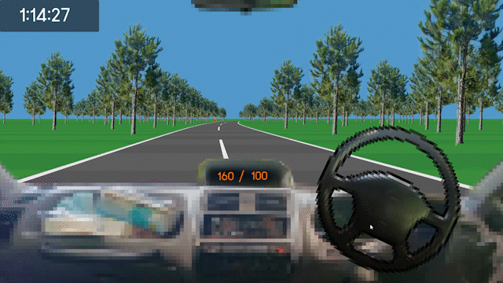

# Driving is hard
*Built June 2026*

A driving simulator but you had to steer the wheel yourself. Hold it at the right angle to accommodate the road curves. You also have to manually shift the gear.

## About
Built solo with [Godot 4.6.2](https://godotengine.org/) in 7 days for [The Very Serious Juniper Dev Game Jam](https://itch.io/jam/theveryseriousjuniperdevgamejam), under the theme "Spin To Win".

*Note: Actual development time was about 2 days due to college work during the week.*

## How to Play
- Control
    - `Number 1, 2, 3, 4` to change gear
    - `Space Bar` to brake
    - `Mouse` to steer the wheel
- Goal
    - Get a driver license

## Play It
- [Play the game now](https://okasn.itch.io/driving-is-hard)
- [Jam submission page](https://itch.io/jam/theveryseriousjuniperdevgamejam/rate/4717948)